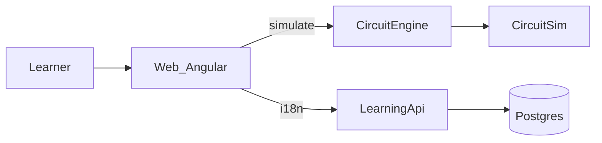
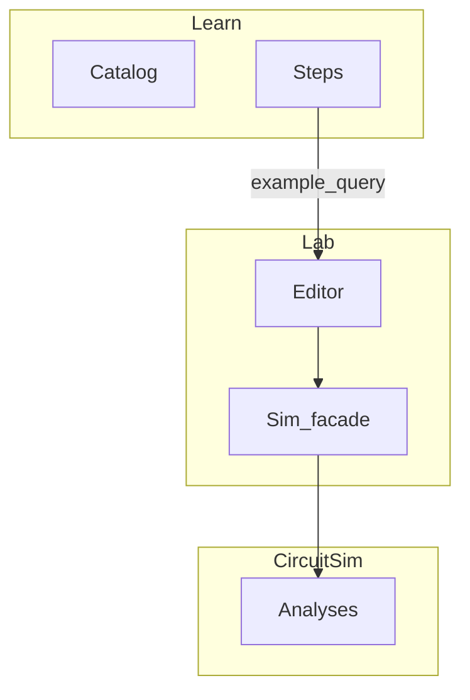

# Architecture

How the pieces fit — **today** and **target**. Module inventory: [modules.md](modules.md). Product picture: [product-overview.md](product-overview.md). Domain: [domain-model.md](domain-model.md). Deployment: [adr/006-deployment-style.md](adr/006-deployment-style.md). Legacy table: [product-architecture.md](product-architecture.md).

## Today vs target

| Area | Today (Phase A) | Target (mature product) |
|------|-----------------|-------------------------|
| Lab | Shipped, frozen | Same scope unless ADR |
| Learn | Template + i18n strings | Full catalog, modules/units, quizzes later |
| Learn URLs | Mostly `/learn` | `/learn/{module}/{unit}` indexable |
| Catalog storage | TS in repo (Phase B) | Optional Postgres via LearningApi |
| Progress | Optional local | Server with Account |
| Public rendering | CSR Angular | Prerender/SSR for Learn + home ([ADR-007](adr/007-seo.md)) |
| Account | Stub | Auth + profile |

Build Phase B against **target** URLs and data shapes even when storage is still client-side ([ADR-002](adr/002-learn-content-source.md), [domain-model.md](domain-model.md)).

## SEO surfaces (NFR-12)

Design from Phase B onward — not a polish pass. Plan: [seo-plan.md](seo-plan.md).

| Surface | SEO expectation |
|---------|-----------------|
| **Marketing / home** | Fully indexable; strong title/description |
| **Learn** modules & units | Indexable; unique titles/URLs; prerender or SSR; structured data when shell ships |
| **Lab editor** `/lab` | `noindex` — tool, not an article |
| **Account** | `noindex` |

Learn design must plan for prerender/SSR so crawlers and AI preview bots see real text ([adr/007-seo.md](adr/007-seo.md)).

## Style in one sentence

**Small number of deployables** (web + CircuitEngine + LearningApi + DB), not a microservice fleet. CircuitSim is a **library** inside CircuitEngine. New services need an ADR ([ADR-006](adr/006-deployment-style.md)).

## Scaling (NFR-9 / NFR-10)

| Piece | Scale story |
|-------|-------------|
| **Web** | Static/SPA assets — CDN/replicas later |
| **CircuitEngine** | Stateless HTTP — scale replicas when simulate load rises |
| **LearningApi** | Read-mostly — scale out; Postgres is the shared limit |
| **Postgres** | Vertical first; pooling/replicas when measured |

Stateless APIs avoid a monolith rewrite under Lab traffic. Measure before heavy caching.

## Big picture (today)

Browser talks to two APIs. CircuitEngine has no session state. LearningApi owns translations; catalog/progress may join when ADRs say so.

## Deployables

| Piece | Path | Job | Notes |
|-------|------|-----|--------|
| Web | `apps/web` | Lab / Learn / Account stub | Grow Learn; don’t grow Lab features |
| CircuitEngine | `services/circuit-engine` | Validate JSON, run CircuitSim | Stable contract |
| CircuitSim | `src/ElectroLab.CircuitSim` | Solver | Stable contract |
| LearningApi | `services/learning-api` | i18n; catalog/progress later | |
| Postgres | Compose `db` | Translations (+ future Learn tables) | |
| Proxy | `deploy/proxy` | Compose routing | |

## Contexts

Learn never imports solver code. Lab never owns lesson text beyond presets and example ids.

## How Learn opens Lab

Learn links to `/lab?example=<id>`. Lab maps that id to a preset in `lab-page` / `LabEditorStore`. That mapping is a **contract** — don’t rename casually.

## Where data lives

| Data | Where (Phase B start) | Target option |
|------|----------------------|---------------|
| Schematics / tabs | Browser `localStorage` | Same unless cloud save ADR |
| Sim results | Request/response only | Same |
| UI strings | Postgres + EN fallback | Same |
| Learn catalog | TS module in repo | Postgres via LearningApi |
| Progress | Optional local | Server with Account |
| Users | — | Postgres + auth |

## When things break

| Problem | Lab | Learn |
|---------|-----|-------|
| LearningApi down | EN fallback | Client catalog if in repo |
| CircuitEngine down | Run error | Learn still readable |
| Postgres down | Same as API down | Same |
| `localStorage` blocked | Tabs may not save | Local progress won’t stick |

## Contracts we treat carefully

- [netlist-schema.md](netlist-schema.md) — bump `schemaVersion` + ADR if breaking
- [circuit-engine.md](circuit-engine.md)
- CircuitSim tests and Lab preset checks

## Path forward

1. Pass gates G0–G2 ([roadmap.md](roadmap.md))
2. Phase B: [requirements-learn-mvp.md](requirements-learn-mvp.md)
3. Server catalog when ADR approves (same DTO shape as [domain-model.md](domain-model.md))
4. Account, then server progress

Decisions: [adr/](adr/).
