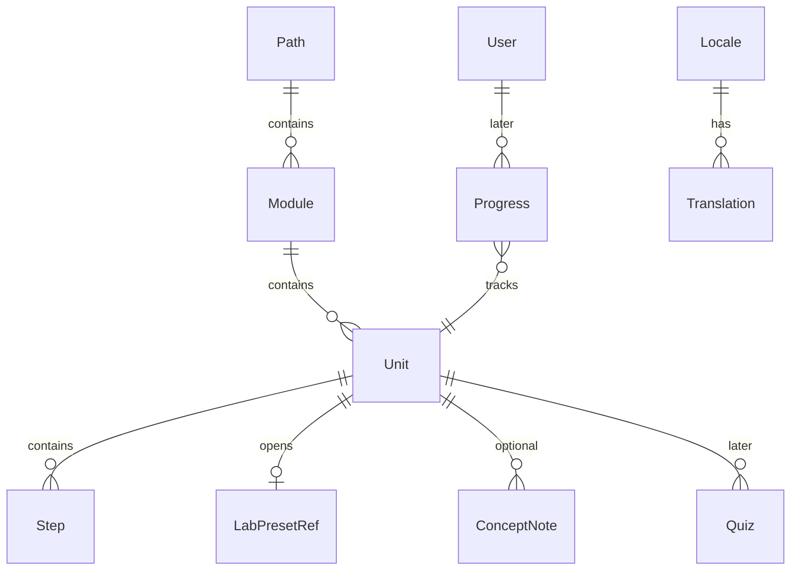

# Domain model (target)

Conceptual model for the **mature product** — not a database schema. Use it to keep bounded contexts clean.

Contexts: [architecture.md](architecture.md). Terms: [glossary.md](glossary.md). Phase B uses a subset.

---

## Bounded contexts

| Context | Owns | Must not own |
|---------|------|--------------|
| **Lab** | Schematic document, slots, wires, simulate requests, local tabs | Lesson text, user identity, quiz scores |
| **CircuitSim** | MNA solve, device models, analyses | HTTP, UI, i18n, catalog |
| **Learn** | Paths, modules, units, steps, links to Lab | Solver code, netlist editing rules |
| **Catalog** (logical) | Stable ids, ordering, Lab example mapping | Simulation results |
| **Progress** (logical) | Step done, quiz attempts, module completion | Schematic state |
| **Identity** (later) | User, session, profile | Circuit topology |
| **Localization** | Locale, translation keys/values | Business rules for Learn order |

Today Catalog and Progress mostly live inside **Learn** (client). Localization is **LearningApi** + web fallback.

---

## Core entities (at maturity)

### Learn / Catalog

| Entity | Description |
|--------|-------------|
| **Path** | Top-level learning journey (e.g. “Practical electronics”) |
| **Module** | Theme hub (e.g. switching, timing) — maps to `/learn/{module}` |
| **Unit** | One teachable project (~10–25 min) — maps to `/learn/{module}/{unit}` |
| **Step** | Ordered checklist item inside a unit |
| **LabPresetRef** | Stable `example` id → Lab preset factory |
| **ConceptNote** | Short explainer before Run (i18n) |
| **Quiz** / **Challenge** | Formative check or open task (post–Phase B) |

### Lab

| Entity | Description |
|--------|-------------|
| **SchematicDocument** | Components, wires, ground net — [netlist-schema.md](netlist-schema.md) |
| **CircuitTab** | Named open circuit in browser storage |
| **Preset** | Seeded schematic for teaching |

### Identity / Progress (later)

| Entity | Description |
|--------|-------------|
| **User** | Account holder |
| **Progress** | Per-user state: steps done, quiz attempts, module % |
| **Attempt** | One quiz submission |

### Localization

| Entity | Description |
|--------|-------------|
| **Translation** | `locale` + `key` + `value` in Postgres |
| **i18n key** | Stable id in code (`learn.project.*`) |

---

## Data placement (target)

| Data | Today (Phase A–B start) | Target option |
|------|-------------------------|---------------|
| Schematic / tabs | Browser `localStorage` | Same unless cloud save ADR |
| Sim results | Request/response | Same (stateless) |
| Translations | Postgres | Same |
| Catalog metadata | TS module in repo ([ADR-002](adr/002-learn-content-source.md)) | Postgres via LearningApi when ADR says |
| Progress | Optional `localStorage` | Postgres with Account |
| Users | — | Postgres + auth provider |

**Migration rule:** Phase B catalog shape (ids, module, unit, steps, `exampleId`) should match future API DTOs so moving off the TS module is a **transport change**, not a curriculum rewrite.

---

## Integration points

| From | To | Mechanism |
|------|-----|-----------|
| Learn unit | Lab preset | `/lab?example=<id>` |
| Lab | CircuitEngine | `POST /api/circuit/simulate` |
| Web | LearningApi | `GET` translations (and future catalog) |
| Learn | i18n | Keys in catalog + `en-fallback` / API |

Learn **never** imports CircuitSim. Lab **never** stores lesson prose beyond preset teaching notes.
