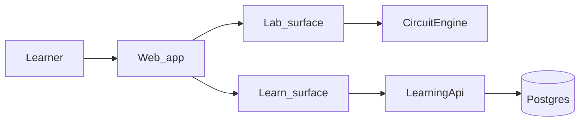

# Product overview

Brief picture of **what Electro Lab is meant to become** — not only what ships in the next phase.

Deeper detail: [vision.md](vision.md) (principles), [learn-content-map.md](learn-content-map.md) (curriculum), [architecture.md](architecture.md) (systems), [requirements.md](requirements.md) (FR categories, NFRs), [cross-cutting-concerns.md](cross-cutting-concerns.md) (logging, SEO, analytics, a11y, …).

---

## One line

People **learn practical electronics** by following short guided paths and **building real circuits in the browser** with an honest teaching simulator.

---

## Who it’s for

**Beginner / hobbyist** — Wants to try an LED, a transistor switch, or I2C wiring without buying parts first. Needs clear steps and instant feedback when something is wired wrong.

**Student** — Follows a structured path (modules → units), checks off steps, and lands in the right Lab example every time. May use it alone or alongside a course.

**Teacher** (later) — Points learners at stable URLs: a Learn unit plus a matching Lab preset. Does not need a full LMS; needs trustworthy, shareable content.

---

## Three surfaces at maturity

| Surface | Role | Maturity |
|---------|------|----------|
| **Lab** (`/lab`) | Schematic editor + teaching simulator (DC, transient, AC). Serious workbench; local tabs and presets. | **Shipped (v1 frozen)** — fixes, a11y, i18n only unless ADR reopens scope |
| **Learn** (`/learn`) | Game-like guide: paths, modules, units, steps, later quizzes/challenges and visible progress. Every unit ties to Lab when a preset exists. | **Next** — catalog and UX first; assessments and richer progress later |
| **Account** (`/account`) | Sign-in, profile, cloud progress, teacher-friendly links. | **Later** — anonymous Learn stays valid |

Lab teaches by **doing**. Learn teaches by **guiding**. Account remembers **who you are** when you want that.

---

## What the experience should feel like

- **Teaching-first** — Models simplify on purpose; copy says what is simplified and why.
- **A bit game-like** — Learn feels closer to Duolingo than a PDF: short units, obvious next step, encouraging feedback, progress you can see (checkmarks → quizzes → streaks only when they earn their place).
- **Discoverable** — Public Learn and landing pages rank for how people already search (“learn electronics”, project how-tos) and work in an **AI-era** search world (clear answers, steps, pitfalls — not keyword stuffing).
- **Honest failure** — APIs down → visible errors or English fallback; no silent broken states.

---

## Differentiators

1. **Integrated path + simulator** — Read steps, click Open in Lab, same circuit, same teaching models.
2. **Honest teaching models** — Not SPICE, not a toy; good enough to learn wiring and intuition.
3. **Progressive curriculum** — Designed path from basics through switching, timing, sensors, and interfaces ([learn-content-map.md](learn-content-map.md)).
4. **Browser-native** — No install; works on laptop and phone-sized screens for Learn (Lab usable on both).

---

## What we are not building

| Out of scope | Why |
|--------------|-----|
| Full SPICE / datasheet-accurate semiconductors | Wrong product; teaching models are enough |
| PCB design / KiCad replacement | Different tool |
| Full MCU / firmware simulation | Wiring-level teaching only (e.g. I2C pull-ups, not bit streams) |
| Real-time collaborative editing | Huge cost; not core to learning |
| Native mobile apps | Web first; prove product before platform split |

Reopening any of these needs an explicit ADR and curriculum justification.

---

## How the pieces fit

- **CircuitSim** — pure solver library inside CircuitEngine (no HTTP, no Learn).
- **LearningApi** — translations today; catalog and progress may move here when ADRs say so.
- **Content** — curriculum in repo now; server catalog and CMS are future options with migration paths ([ADR-002](adr/002-learn-content-source.md)).

---

## Phased delivery (summary)

| Phase | Focus | Status |
|-------|--------|--------|
| A — Lab v1 | Editor, simulator, presets | Done |
| B — Learn foundation | Catalog, unit pages, Lab deep-links, SEO-ready public pages | Next |
| C — Account + cloud progress | Auth, server progress, teacher links | Later |
| D — Polish | More locales, deeper a11y, production ops | Later |

Gate details: [roadmap.md](roadmap.md). Phase B FRs only: [requirements-learn-mvp.md](requirements-learn-mvp.md).

---

## Where we are now

Lab v1 is **complete and frozen**. The product is **not** defined by Phase B alone — Phase B is the first Learn implementation slice after analysis and architecture gates pass.

Before large Learn builds: read this overview, [analysis-checklist.md](analysis-checklist.md), and [risks-and-deferrals.md](risks-and-deferrals.md).
